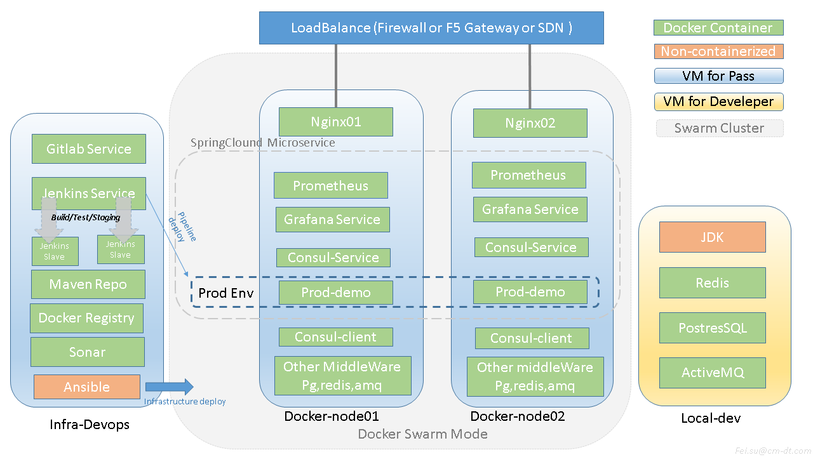

# Jenins Pipeline的Demo演示程序。

---

## 概述
特点完是完全Docker容器化的，采用基于SprinClound的微服务概念。
程序中含带了部署和开发环境的常用中间键，有以下服务组成:
   - Docker Swarm: 作用于Docker Cluster
   - Jfrog Pro : 主要作用于Maven私服以及Docker Registry
   - SonarQube : 代码质量分析
   - GitLab    : 图形界面的GIT管理系统
   - Jenkins   : 基于2.6版本，采用DockerInDocker的Slave节点概念来进行部署
   - Consul    : 用于生产环境的服务发现,自动更新Nginx配置
   - Nginx     : 作用于入口处的负载均衡
   - 监控系统  : 基于Grafana的WEB图形监控系统


## 设计思想
  

## 安装方式：
####   本Demo系统，共为三个部署阶段:
    1.构建虚拟机:   可在Windows下进行部署，但需要安装VirtualBox+Vagrant虚拟化软件.
    2.部署平台基础设施: 采用脚本方法一键安装
    3.发布应用：    运行jenkins任务，jenkins将采用pipeline的流程进行发布
    
## 安装需求:
  本Demo系统是在windows平台完成的，理论上来说Mac或物理机方式部署也可以。
  
但由于guestOS下的虚拟化客户端（类似于VmwareTools）会随内核和Vagran、VirtualBox的版本而改变。如果虚拟化客户端不能正常启动，那将无法使用Vagrant自带的共享目录服务。而Vagrantfile里涉及大量的宿主机文件，所以有可能会导致无法使用。因此建议尽可能使用以下版本:
- VirtualBox-5.1.28-117968-Win.exe
- vagrant_1.9.6_x86_64.msi

  部署需要资源,CPU:4Core Memory:8GB( 2c4g*1 + 1c2g*2 )

## 代码目录结构   
- Vagrantfile   Vagrant部署脚本
- rpms/         Vagrant部署时所用到rpms
### Deploy/   部署环境的相关文件(解决docker yum源下载不稳定)
- Deploy/jenkins-pipeline/docker-compose   jenkins部署文件
- Deploy/gitlab/docker-compose    gitlab部署文件
- Deploy/images     部分离线Docker镜像(解决dockhub.io下载不稳定)
- Deploy/rpms       部署机离线rpms包
- Deploy/all-in-one-deploy.sh   部署环境自动安装脚本
### Server/   生产环境的相关文件
- Server/consul-template-demo/docker-compose  服务发现和Nginx部署
- Server/prometheus/docker-compose  grafana监控系统部署
- Server/images       部分离线Docker镜像(解决dockhub.io下载不稳定)


## 安装步骤:
- 安装virtualbox
- 安装vagrant
- 导入vbox：在本目录下，打开cmd,运行: 
```
vagrant box add --name bento/centos-7.3 bento.centos-7.3
```

- 开始构建devops虚拟环境: 运行
```
vagrant up
```

- 开始构建PaaS平台：

虚拟机构建完成后，登陆部署机ssh://192.168.33.100,账号root/root

在部署机里运行 /vagrant/Deploy/all-in-one-deploy.sh

先尝试打开http://192.168.33.201/demo/,由于还未部署应该为404未找到。

- 部署应用: 

浏览器打开http://192.168.33.100:8080, 打开sufei-demo项目，单击立即构建
再试尝试打开http://192.168.33.201/demo/或...33.202/demo/,正常应该可以打开页面。
(可能会报其它错误，这是由于java程序并没有实现任何逻辑)


---
# 后台管理备忘录

## VM的SSH账号与密码
infra-devops:  192.168.33.100 root/root

docker-node01: 192.168.33.201 root/root

docker-node01: 192.168.33.202 root/root

## 系统管理登陆
Jenkins:  http://192.168.33.100:8080/

JFrog Artifactory: http://192.168.33.100:8000/  (admin/password)

GitLab: http://192.168.33.100:10080/  (root/password)

Sonar:  http://192.168.33.100:9000/dashboard?id=demo  (admin/admin)


#


###### 完

###### Fei.Su@cm-dt.com 20171113
